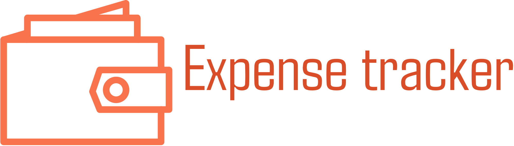

# Expense Tracker

An easy-to-use web application for tracking your expenses. This project allows users to add, view, and delete expenses, with the total expenses displayed prominently.



## Features

- Add new expenses with amount, date, description, and payment mode.
- View a list of all expenses.
- Delete individual expenses.
- See the total amount of expenses.

## Technologies Used

- HTML
- CSS (Bootstrap)
- JavaScript

## Usage

1. Fill in the amount, date, description, and payment mode in the form.
2. Click "Add to Expense" to add the expense to the list.
3. View the added expenses in the list below the form.
4. Click the trash icon to delete an expense.
5. The total expenses are displayed at the bottom of the page.

## File Structure
```
├── css
│ └── style.css
├── images
│ ├── Expense-Tracker.png
│ └── icons8-expense-64.png
├── js
│ └── app.js
├── index.html
└── README.md
```

## Contributing

Contributions are welcome! Please fork this repository and submit a pull request for any improvements or bug fixes.

## License

This project is licensed under the MIT License - see the [LICENSE](LICENSE) file for details.

## Acknowledgments

* [Bootstrap](https://getbootstrap.com/)
* [Font Awesome](https://fontawesome.com/)
* [Icons8](https://icons8.com/)
